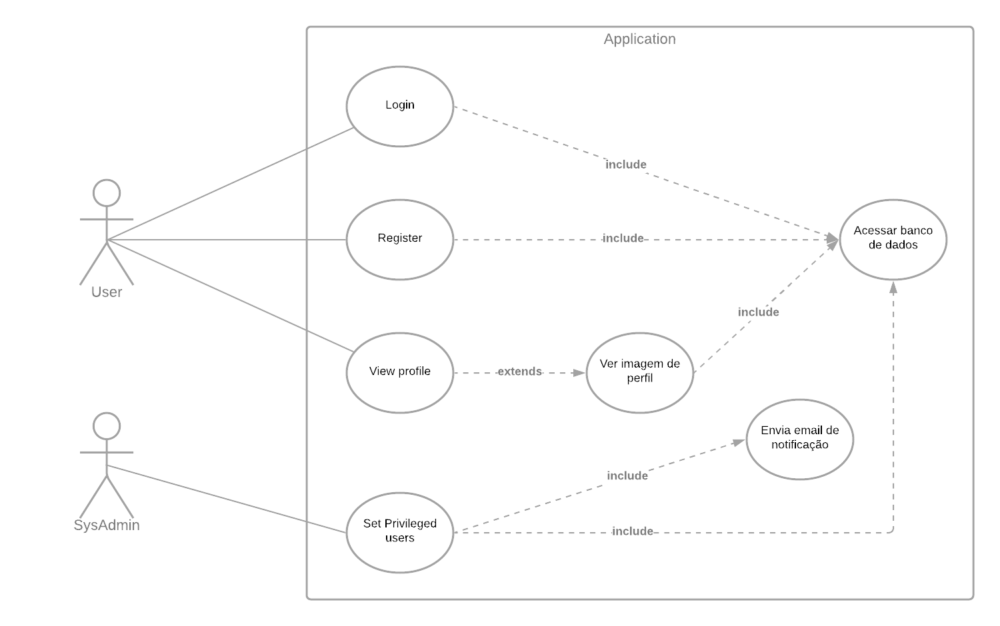
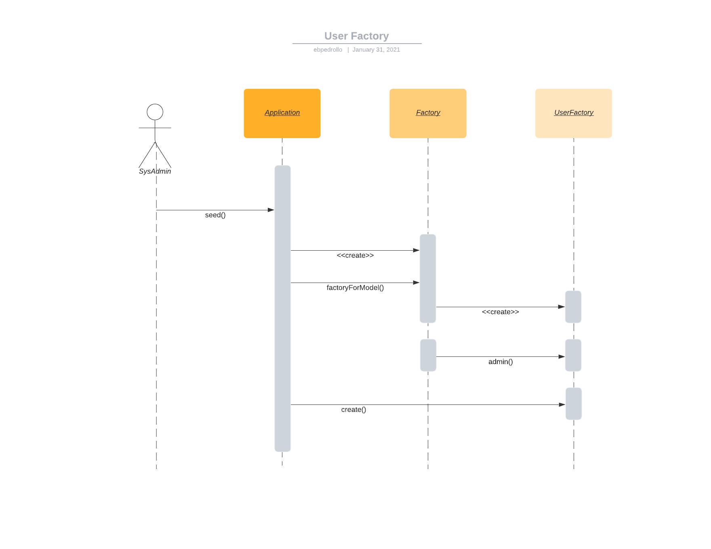
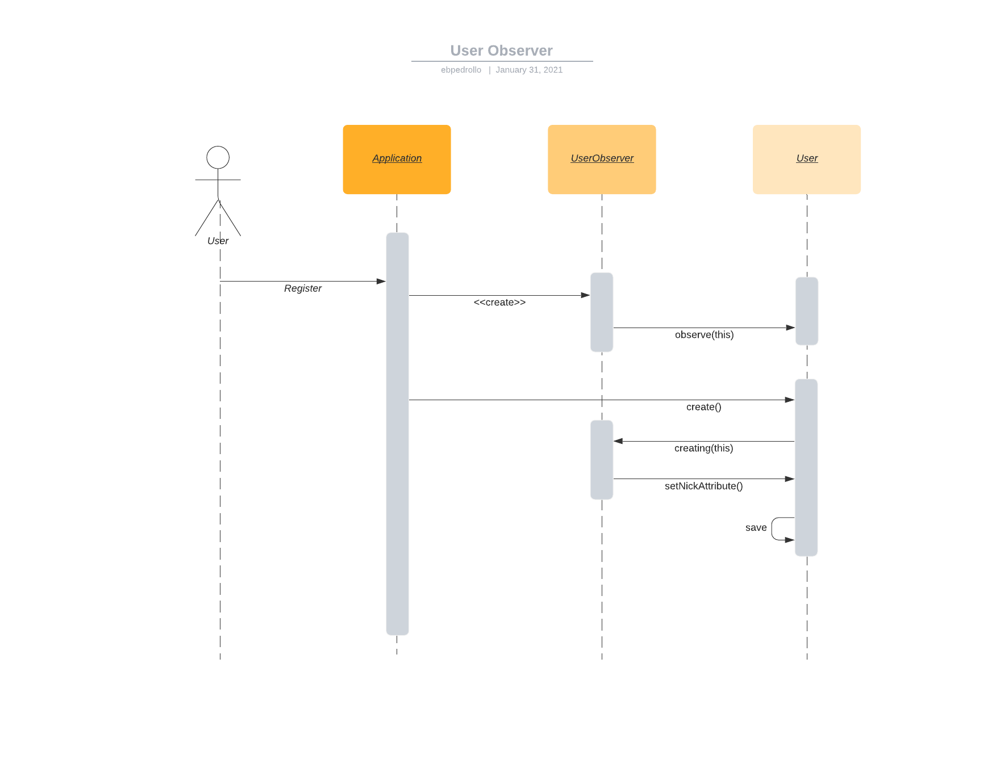

# APSOO

## Padrões Utilizados

### De Criação

#### Factory 
   
O padrão de criação Factory é utilizado na criação de usuários tanto no momento de registro quanto num momento inicial
de população de usuários para demo (seed).

As classes envolvidas neste padrão são `Factory`, da qual sempre se espera um objeto da classe `Model`, `UserFactory` 
que estende `Factory` e devolve um objeto da classe `User` que estende `Model`.

#### Builder

Para simplificar a criação de usuários com propriedades diferentes a classe `UserFactory` também se comporta como um 
`Builder` contendo métodos auxiliares que ajudam na customização na hora de criar um usuário.

Isto é possível, pois a classe `UserFactory` é registrada como a factory para a classe `User`, desta forma quando o 
programador invoca `User::factory()` uma instância da classe `UserFactory` é devolvida.
   
#### Singleton

_Singletons_ são controlados pela própria aplicação que haja como um _mediator_, a vantagem é a possibilidade de se ter
_override_ de um determinado singleton para alguma situação especial (como testes unitários) e da possibilidade de se 
ter _dependency injection_ durante a construção da instância de uma determinada _singleton_.

Na classe `GravatarServiceProvider` um _singleton_ para `Gravatar` é registrado na aplicação, por acaso este singleton 
também é um _decorator_ e uma classe utilizada por uma _facade_.

Após a execução do _provider_ mencionado acima sempre que o programador quiser acesso ao objeto da classe 
`GravatarDecorator` que foi registrado como singleton, basta utilizar o _mediator_ app para obtê-lo:

```php
$gravatarDecorator = app('gravatar');
```

> Nota: o sistema só irá instanciar um objeto quando ele for chamado pela primeira vez.

### Estruturais

#### Facade

Como dito acima no sistema também há uma _facade_ que se utiliza de uma _singleton_, ela é registrada na aplicação e 
sempre que é invocada retorna o _singleton_ `GravatarDecorator`. Esta facade também incorpora comportamento complexo de
mockagem para testes e repasse de chamadas estáticas para o _singleton_.
   
#### Decorator

Há múltiplos Decorators existentes no sistema. Em especial temos o `GravatarDecorator` que tem como papel principal
extender funcionalidades de uma biblioteca antiga. Talvez a sua implementação também se encaixe no padrão 
_Class Adapter_.

Também há _decorators_ para classes de pacotes de terceiros como, por exemplo: 

 - `Builder` responsável pela criação de queries de forma pragmática para o banco de 
   dados. Este _decorator_ não estende o objeto que deseja decorar (`\Illuminate\Database\Query\Builder`), mas o tem 
   como uma _property_ apenas. 
 - `Command` é uma classe que tem como objetivo tratar entradas por linha de comando de um usuário,
   ela estende a classe de terceiros `\Symfony\Component\Console\Command\Command`.
   

### Comportamentais

#### Observer

Algumas coias acontecem de uma forma um pouco diferente do que foi exemplificado em aula:

1. Não é estritamente o _observer_ que se cadastra, mas sim a própria aplicação num determinado momento é a responsável
   por cadastrar os _observers_.
2. _Observers_ são cadastrados em classes e não em objetos por padrão. Apesar de ser possível cadastrar a apenas um
   objeto, neste caso é mais útil cadastrar-se com todos.
3. Os métodos chamados pelo objeto observado no seu _observer_ recebem como argumento o próprio objeto observado ao
   invés de tê-lo como uma property, desta forma uma mesma instância de _observer_ pode ser responsável por N objetos
   observados.

#### Command

Há três exemplos de implementações de padrões de comportamento _Command_ neste sistema.


1. Request

    Por ser uma implementação de um sistema _web_, temos uma classe `Request` que é instanciada num objeto sempre que 
    houver alguma requisição, e neste objeto é incorporado todas as informações necessárias para que uma _chain of 
    responsibility_ determine qual _controller_ devera ser executado para tratar da requisição do usuário bem como 
    todas as informações necessárias para que o _controller_ possa processar uma resposta.
   
    Exemplos de informações que são armazenados neste objeto são: a URI requisitada, o endereço IP do cliente, a 
    _string_ de autenticação fornecida pelo usuário, o método de requisição (GET, HEAD, POST, PUT, DELETE, etc.), o 
    corpo da requisição, os cabeçalhos, os idiomas aceitáveis pelo cliente em ordem de prioridade, os formatos de 
    resposta, etc.


2. Command

    Similar à `Request`, a classe `Command` agrupa informação de entradas do usuário pela linha de comando e é repassado
    posteriormente a uma classe responsável para o seu processamento.
   
    Um objeto da classe `Command` contém informações como: linha de comando executada, opções definidas, argumentos de
    entrada, stream de IO, etc.
   
    A classe `Command` no entanto se difere de uma `Request` pelo fato de que a classe que deverá realizar o 
    processamento das informações contidas nela é uma classe herdeira dela mesma. 
   
3. Events

    Em algum momento, quando algo especial acontecer dentro de alguma estrutura o programador pode julgar prudente 
    a criação de um Evento, ele irá então imbuir este evento de todas as informações relevantes associadas a ele e por 
    fim ira anuncia-lo. A aplicação, agindo como um _mediator_ irá então instanciar todas as classes registradas 
    (_listeners_) naquele evento para processa-lo utilizando as informações contidas nele.
   
    Neste sistema há duas implementações de eventos: `UserSetAsAsmin` e `UserUnsetAsAdmin` que possuem apenas uma classe
    cada que se registra a elas: `SendNewAdminMail` e `SendDemoteMail` respectivamente.
   

#### Iterator

A classe `Collection` se assemelha em funcionalidade da sua homônima no _Java_ permitindo dentre outras funcionalidades
a listagem e iteração de uma coleção de objetos.

#### Memento

Tendo em vista a implementação de _Events_ e _Listeners_ descrita no ponto 3 de [Command](#Command) é possível de se 
deseje que um determinado _listener_ seja executado assincronamente ou até mesmo agendado para uma execução em algum 
momento no futuro. Para que isso seja possível todas as informações daquele _listener_ bem como do _event_ associado 
a ele deve ser armazenadas em algum lugar.

Esse processo é feito através da serialização dos objetos envolvidos. A serialização é feita por uma classe que 
implementa o padrão de _memento_ e por fim transforma tudo em _string_ que podem ser armazenadas no banco de dados e 
posteriormente restauradas através de um processo de desserialização.

Neste sistema _listeners_ que desejam ser executados dessa forma precisam herdar (através da implementação do PHP de 
herança múltipla) da classe `SerializesModels` que aplica o processo de (de)serialização nele mesmo.

Ambos os _listeners_ `SendNewAdminMail` e `SendDemoteMail` implementam este comportamento.   

#### Mediator

Toda a execução do _software_ é mediada por uma estrutura que no PHP é comummente chamada de container (veja PSR-11) e é 
responsável pela mediação de toda a aplicação, seja através de injeções de dependência, de interceptações de chamadas ou
mais comummente de chamadas diretas ao `app` no qual este se responsabiliza de entregar a resposta correta, seja esta 
uma instância de um singleton, uma classe responsável por _log_, a request atual que se comporta como um _command_ ou 
até mesmo um valor escalar referente a um parâmetro de execução.

#### Visitor(ish)

Ok, esta implementação não está nem um pouco parecida com a implementação que vimos em aula, mas devido ao fato do PHP 
ser uma linguagem interpretada ao contrário de uma linguagem compilada há alguns atalhos que podemos tomar.

No PHP há um conceito de métodos mágicos (é esse mesmo o nome) que são métodos de uma classe que são chamados sempre que
um método ou propriedade inexistente são chamados, por exemplo (possui outras utilizações, mas estas são as que nos 
interessa). Desta forma a comunidade surgiu a muitos anos com o conceito de _Macroable_. Uma implementação de métodos
mágicos que permite que uma classe seja infinitamente extensível de forma extremamente simples. Tudo que é necessário é
que a classe possua uma propriedade estática `$macro` que é uma lista de métodos estendidos e uma implementação de 
`__call` que é chamada quando a classe não possuir um determinado método que foi chamado, esta implementação deve olhar
em `$macro` para ver se uma implementação para este método foi registrado por uma extensão e se existir executa-la
com o contexto do objeto.

No sistema a classe `Route` que pertence a um pacote de terceiros responsável pelo processamento das rotas, ligando uma
requisição a um controller não possuí suporte para os métodos _LOCK_ e _UNLOCK_. Este suporte é adicionado através de 
macros em `RouteServiceProvider`.

## Documentação

### Diagramas

#### Caso de Uso



Basicamente um sistema _web_ com cadastro de usuários com dados persistidos num banco de dados. Também é possível
executar algumas tarefas de SysAdmin (como definir usuário como admin.) via comandos de terminal.

#### Classes

//todo

#### Sequência

##### UserFactory



A classe `UserFactory` aqui se comporta como um `Builder` mas também é uma subclasse para a qual a classe `Factory`
delega a construção de objetos da classe `User` que herda de `Model`.

##### UserObserver



O comportamento mais detalhado desta classe é descrito na seção [Observer](#Observer).

### Doxygen

A documentação autogerada pelo _Doxygen_ pode ser encontrada na pasta '_docs_'.

Devido ao tamanho significativo da pasta e do fato de o mesmo não poder ser lido e interpretado pelo _GitHub_ foi 
escolhido que a pasta não constará no repositório porem ela deve estar contida no arquivo compactado enviado na 
atividade do _Google Classroom_.
